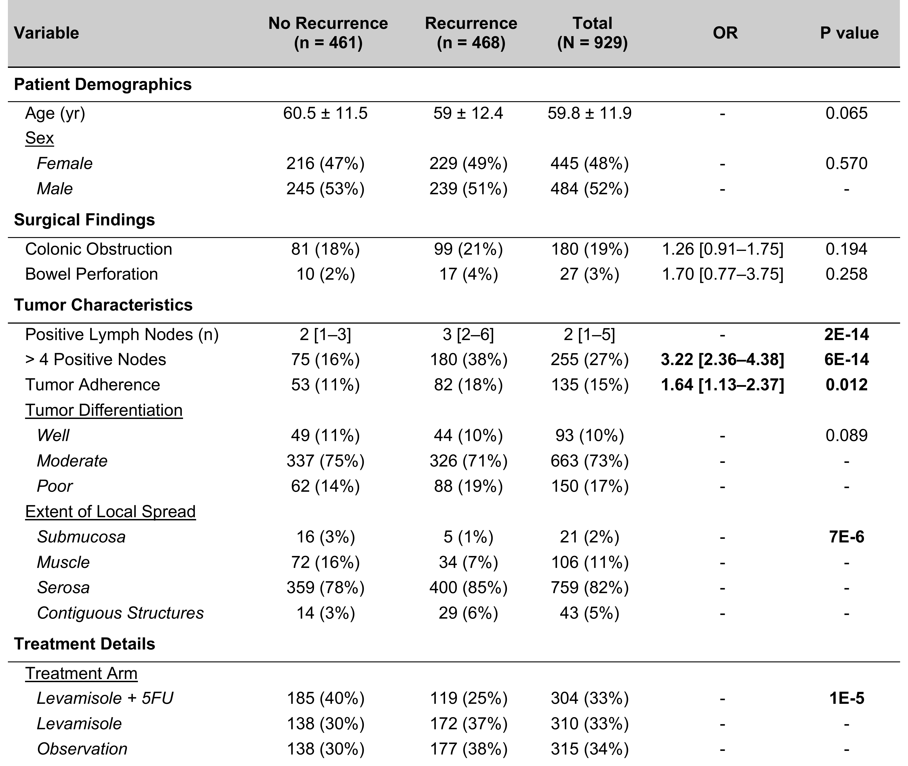

```{r setup, include = FALSE}
knitr::opts_chunk$set(
  collapse  = TRUE,
  comment   = "#>",
  warning   = FALSE,
  message   = FALSE
)
library(TernTables)
# Output directory for exported .docx files.
# Override by setting options(TernTables.vignette_outdir = "/your/path") before rendering.
out_dir <- getOption("TernTables.vignette_outdir", tempdir())
```

## Overview

**TernTables** is built for clinical researchers — physicians, fellows, and
residents who produce clinical papers and need publication-ready summary tables
without manual formatting or statistical decision-making.

It generates publication-ready summary tables for clinical research and takes
them all the way from raw data to a formatted Word document table ready to
paste into a manuscript, without any manual formatting steps.

Given a data frame and an optional grouping variable, it automatically:

- Detects each variable's type (continuous, binary/categorical, or ordinal)
- Selects the appropriate statistical test
- Formats p-values and summary statistics for publication
- Exports directly to a styled `.docx` Word file and generates a boilerplate
  statistical methods paragraph

Three table types are supported: **descriptive summaries** (single cohort, no
comparisons), **two-group comparisons** (with optional odds ratios), and
**comparisons across three or more groups**.

## Example Dataset

```{r load-data}
data(tern_colon)
```

`tern_colon` is bundled with TernTables. It contains 929 patients from a
landmark colon cancer adjuvant chemotherapy trial (Moertel et al., 1990),
filtered to the recurrence endpoint — one row per patient. See
`?tern_colon` for full details.

Key variables used in these examples:

| Column | Description |
|---|---|
| `Age_Years` | Age at registration (years) |
| `Sex` | Female / Male |
| `Colonic_Obstruction` | Colonic obstruction present (N / Y) |
| `Bowel_Perforation` | Bowel perforation present (N / Y) |
| `Positive_Lymph_Nodes_n` | Number of positive lymph nodes |
| `` >_4_Positive_Nodes `` | More than 4 positive lymph nodes (N / Y) |
| `Tumor_Adherence` | Tumour adherence to nearby organs (N / Y) |
| `Tumor_Differentiation` | Well / Moderate / Poor |
| `Extent_of_Local_Spread` | Depth of tumour penetration (4 levels) |
| `Recurrence` | No Recurrence / Recurrence — **2-group** |
| `Treatment_Arm` | Levamisole + 5FU / Levamisole / Observation — **3-group** |

---

## Descriptive Table (`ternD`)

Use `ternD()` for a single cohort with no group comparisons — the standard
"Table 1" in a cohort description. Pass `output_docx` to write a
publication-ready Word file in the same call. Use `category_start` to insert
bold section headers grouping related variables; anchors can be either the raw
column name or the cleaned display label.

```{r ternD-example}
TernDesc <- ternD(
  data             = tern_colon,
  exclude_vars     = c("ID"),
  output_docx      = file.path(out_dir, "Tern_descriptive.docx"),
  methods_filename = file.path(out_dir, "TernTables_methods.docx"),
  category_start = c(
    "Patient Demographics"  = "Age (yr)",
    "Surgical Findings"     = "Colonic Obstruction",
    "Tumor Characteristics" = "Positive Lymph Nodes (n)",
    "Outcomes"              = "Recurrence"
  )
)
TernDesc
```

Continuous variables show mean ± SD or median [IQR] depending on normality
(Shapiro-Wilk, p > 0.05 = normal). Binary columns (including numeric 0/1) are
automatically detected as categorical and shown as n (%). Multi-level
categorical variables show all levels as indented sub-rows beneath the variable
name.

```{r ternD-figure, echo=FALSE, fig.align="center", out.width="45%"}
knitr::include_graphics("figures/tern_descriptive.png")
```

### Export to Excel

```{r ternD-excel, eval = FALSE}
writexl::write_xlsx(TernDesc, "Tern_descriptive.xlsx")
```

---

## Two-Group Comparison (`ternG` — 2 levels)

Use `ternG()` to compare variables between two groups. Set `OR_col = TRUE` to
add odds ratios with 95% CI for binary variables (Fisher's exact or Wald,
chosen automatically based on expected cell counts). The Word file is written
directly via `output_docx`.

```{r ternG-2group}
Tern2v <- ternG(
  data             = tern_colon,
  exclude_vars     = c("ID"),
  group_var        = "Recurrence",
  output_docx      = file.path(out_dir, "Tern_2_group.docx"),
  methods_filename = file.path(out_dir, "TernTables_methods.docx"),
  OR_col           = TRUE,
  insert_subheads  = TRUE,
  category_start   = c(
    "Patient Demographics"  = "Age (yr)",
    "Surgical Findings"     = "Colonic Obstruction",
    "Tumor Characteristics" = "Positive Lymph Nodes (n)",
    "Treatment Details"     = "Treatment Arm"
  )
)
Tern2v
```

The `p` column shows the test p-value; `OR` shows the odds ratio with 95% CI
where applicable.

{width=100%}

### Methods document

`write_methods_doc()` generates a boilerplate methods paragraph listing every
statistical test that was actually used — ready to copy directly into a
manuscript methods section.

```{r methods-doc, eval = FALSE}
write_methods_doc(
  tbl      = Tern2v,
  filename = "Tern_methods.docx"
)
```

---

## Three-Group Comparison (`ternG` — 3 levels)

The same `ternG()` function handles three or more groups automatically,
switching from t-test/Wilcoxon to ANOVA/Kruskal-Wallis as appropriate.
Odds ratios are not available for 3+ group comparisons.

```{r ternG-3group}
Tern3v <- ternG(
  data               = tern_colon,
  exclude_vars       = c("ID"),
  group_var          = "Treatment_Arm",
  group_order        = c("Observation", "Levamisole", "Levamisole + 5FU"),
  output_docx        = file.path(out_dir, "Tern_3_group.docx"),
  methods_filename   = file.path(out_dir, "TernTables_methods.docx"),
  consider_normality = TRUE,
  category_start     = c(
    "Patient Demographics"  = "Age (yr)",
    "Surgical Findings"     = "Colonic Obstruction",
    "Tumor Characteristics" = "Positive Lymph Nodes (n)",
    "Outcomes"              = "Recurrence"
  )
)
Tern3v
```

{width=100%}

---

## Statistical Test Logic

TernTables selects tests automatically based on variable type and normality:

| Variable type | Test (2 groups) | Test (3+ groups) |
|---|---|---|
| Continuous, normal | Welch's *t*-test | ANOVA |
| Continuous, non-normal | Wilcoxon rank-sum | Kruskal-Wallis |
| Binary / Categorical | Fisher's exact or Chi-squared\* | Fisher's exact or Chi-squared\* |
| Ordinal (`force_ordinal`) | Wilcoxon rank-sum | Kruskal-Wallis |

\*Fisher's exact is used when any expected cell count is < 5 (Cochran criterion).

Normality is assessed with the Shapiro-Wilk test (p > 0.05 = normal) applied
per group; a variable is treated as normally distributed only if all groups
pass. If any group fails — or if a group has fewer than 3 observations and
normality cannot be evaluated — the nonparametric test is used (conservative
fail-safe). For 3+ group comparisons, omnibus p-values are reported; pairwise
post-hoc comparisons are not performed.

---

## References

Moertel CG, Fleming TR, Macdonald JS, et al. (1990). Levamisole and fluorouracil
for adjuvant therapy of resected colon carcinoma. *New England Journal of Medicine*,
**322**(6), 352–358. <https://doi.org/10.1056/NEJM199002083220602>
