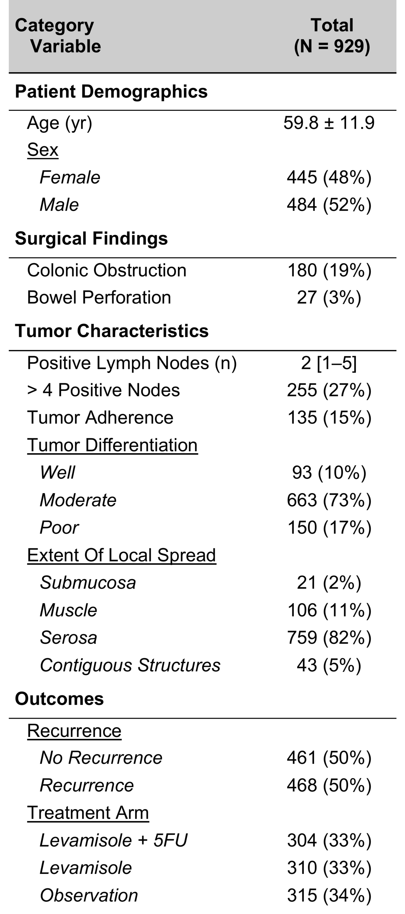
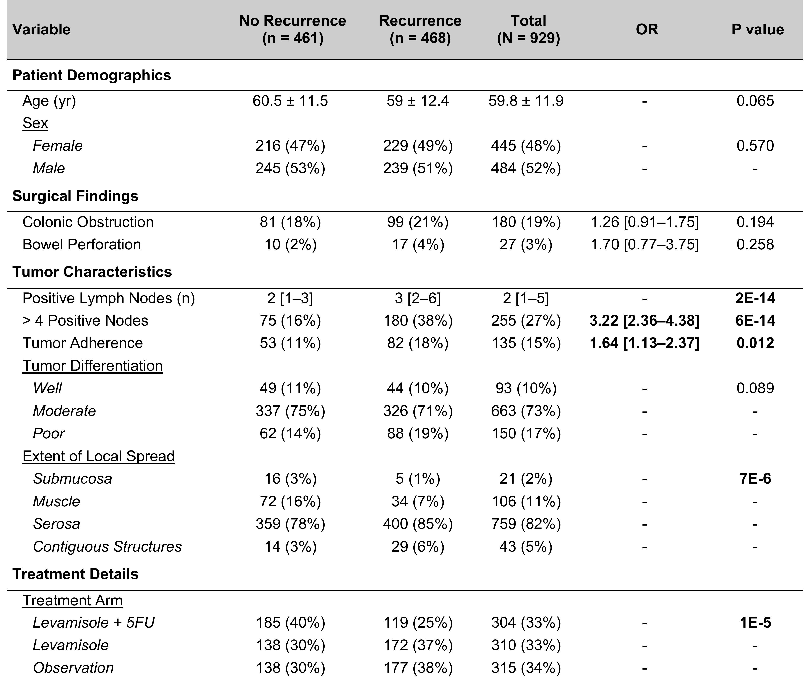
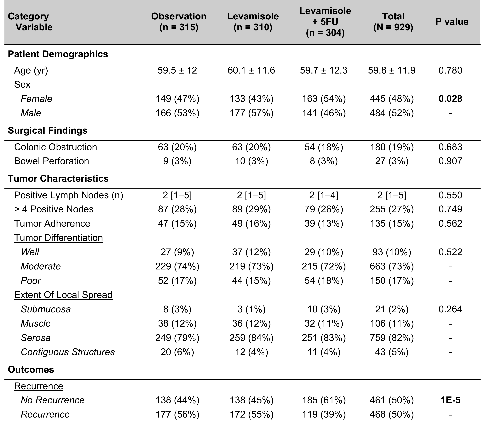

```{r setup, include = FALSE}
knitr::opts_chunk$set(
  collapse  = TRUE,
  comment   = "#>",
  warning   = FALSE,
  message   = FALSE
)
library(TernTables)
options(tibble.width = Inf)  # show all columns in printed tibbles
# Output directory for exported .docx files.
# Override by setting options(TernTables.vignette_outdir = "/your/path") before rendering.
out_dir <- getOption("TernTables.vignette_outdir", default = tempdir())
```

```{css, echo = FALSE}
img { border: none !important; box-shadow: none !important; }
```

## Overview

**TernTables** is built for clinical researchers who need to go from raw data to a manuscript-ready Word table — with variable detection, statistical test selection, and formatting all handled automatically.

Given a data frame and an optional grouping variable, it automatically:

- Detects each variable's type (continuous, binary, categorical)
- Selects the appropriate statistical test
- Formats *P* values and summary statistics for publication-ready tables
- Exports directly to a styled `.docx` Word file and generates a boilerplate
  statistical methods paragraph
- Returns a tibble for inspection, Excel export, or further analysis in R

Three table types are supported: **descriptive summaries** (single cohort, no
comparisons), **two-group comparisons** (with optional unadjusted odds ratios), and
**comparisons across three or more groups**.

The convenience is in the automation, not in any compromise to statistical
rigor. Test selection follows established published criteria throughout:
normality by Shapiro-Wilk per group, Fisher's exact triggered by the Cochran
(1954) expected-cell criterion, and odds ratios reported as unadjusted with
the first factor level of the grouping variable as the reference. The auto-generated methods paragraph covers the statistical approach used and is suitable as a starting draft for a manuscript methods section.

> **No R required?** TernTables is available as a free point-and-click web
> application at [tern-tables.com](https://tern-tables.com/). Upload a CSV
> or XLSX, configure your table, and download a formatted Word document —
> all without writing a line of code. The web app is powered by this package,
> so the statistical methods, normality routing, and Word output are identical.
> A built-in side panel shows the R commands running in the background and
> the full script can be downloaded at the end of your session, making every
> analysis fully transparent and reproducible. For scripted or reproducible
> workflows, the R package (this vignette) remains the canonical reference.

> **Scope — independent observations only:** all statistical tests in `ternG()`
> assume each row represents a distinct, unrelated subject. TernTables is **not**
> designed for repeated-measures, longitudinal, or clustered data (e.g.
> pre/post measurements, matched pairs, or patients nested within sites).
> Applying it to such data would violate the independence assumption shared by
> all tests in the package and produce invalid *P* values.

## Example Dataset

```{r load-data}
data(tern_colon)
```

`tern_colon` is bundled with TernTables. It is derived from `survival::colon`
and contains 929 patients from a landmark colon cancer adjuvant chemotherapy
trial (Moertel et al., 1990), filtered to the recurrence endpoint — one row
per patient. See `?tern_colon` for full details.

Key variables used in these examples:

| Column | Description |
|---|---|
| `Age_Years` | Age at registration (years) |
| `Sex` | Female / Male |
| `Colonic_Obstruction` | Colonic obstruction present — n (%) |
| `Bowel_Perforation` | Bowel perforation present — n (%) |
| `Positive_Lymph_Nodes_n` | Number of positive lymph nodes |
| `Over_4_Positive_Nodes` | More than 4 positive lymph nodes — n (%) |
| `Tumor_Adherence` | Tumour adherence to nearby organs — n (%) |
| `Tumor_Differentiation` | Well / Moderate / Poor |
| `Extent_of_Local_Spread` | Depth of tumour penetration (4 levels) |
| `Recurrence` | No Recurrence / Recurrence — **2-group** |
| `Treatment_Arm` | Levamisole + 5FU / Levamisole / Observation — **3-group** |

---

## Preprocessing Raw Data (`ternP`)

If your source is a raw CSV or XLSX file — rather than an already-clean R
object — use `ternP()` to standardize it before passing it to `ternG()` or
`ternD()`. It handles the messiness most commonly introduced by manual data
entry or spreadsheet workflows:

| Transformation | What it fixes |
|---|---|
| String NA conversion | `"NA"`, `"na"`, `"Na"`, `"unk"` → `NA` |
| Whitespace trimming | Leading/trailing spaces in character columns |
| Empty column removal | 100% `NA` columns silently dropped |
| Blank row removal | Rows where every cell is `NA` |
| Case normalization | `"fEMALE"` / `"Female"` unified to title case |

`ternP()` also applies two **hard stops** before any cleaning takes place:
it errors immediately if any column name matches a protected health information
(PHI) pattern (e.g. `MRN`, `DOB`, `FirstName`), or if any unnamed column
contains data.

```{r ternP-run, eval = FALSE}
# Load a messy CSV shipped with the package
path <- system.file("extdata/csv", "tern_colon_messy.csv",
                    package = "TernTables")
raw    <- readr::read_csv(path, show_col_types = FALSE)
result <- ternP(raw)
# The print method fires automatically, summarising every transformation applied.
```

The printed summary identifies each transformation and shows the final
dimensions of the cleaned data. If the data was already clean, a single
"No transformations required" line appears.

Three items are returned in the result object:

```{r ternP-access, eval = FALSE}
result$clean_data    # Cleaned, analysis-ready tibble
result$sparse_rows   # Rows with >50% NA (retained, not removed — review these)
result$feedback      # Named list; NULL elements mean no action was taken
```

To write a Word document recording the cleaning steps, call
`write_cleaning_doc()`. It is fully dynamic — only paragraphs for triggered
transformations are written, so the document is concise for already-clean data.

```{r ternP-doc, eval = FALSE}
write_cleaning_doc(result,
                   filename = file.path(out_dir, "cleaning_summary.docx"))
```

Once preprocessing is complete, pass `result$clean_data` directly to `ternD()`
or `ternG()`:

```{r ternP-handoff, eval = FALSE}
tbl <- ternG(result$clean_data,
             exclude_vars = c("ID"),
             group_var    = "Recurrence")
```

---

## Descriptive Table (`ternD`)

Use `ternD()` for a single cohort with no group comparisons — the standard
"Table 1" in a cohort description. Pass `output_docx` to write a
publication-ready Word file in the same call; pass `output_xlsx` to also save
the tibble as an Excel file. Use `category_start` to insert bold section headers
grouping related variables; anchors can be either the raw column name or the
cleaned display label.

```{r ternD-example, results = "hide"}
tbl_descriptive <- ternD(
  data             = tern_colon,
  exclude_vars     = c("ID"),
  output_docx      = file.path(out_dir, "Tern_descriptive.docx"),
  methods_filename = file.path(out_dir, "TernTables_methods.docx"),
  open_doc         = FALSE,
  category_start = c(
    "Patient Demographics"  = "Age (yr)",
    "Surgical Findings"     = "Colonic Obstruction",
    "Tumor Characteristics" = "Positive Lymph Nodes (n)",
    "Outcomes"              = "Recurrence"
  )
)
tbl_descriptive
```

Continuous variables show mean ± SD or median [IQR] based on the four-gate
ROBUST normality algorithm (n < 3 fail-safe, skewness/kurtosis check, CLT at n ≥ 30,
Shapiro-Wilk for small samples). Columns whose values are exactly Y/N,
YES/NO, or numeric 0/1 are detected as binary and shown as a single n (%) row
(the positive/yes count). All other categorical variables — including two-level
variables like Male/Female — are shown with each level as an indented sub-row.

Variable names are automatically cleaned for display (`smart_rename = TRUE` by
default) — underscores replaced with spaces, capitalisation normalised, and
common medical abbreviations formatted (e.g. `Age_Years` → `Age (yr)`,
`Positive_Lymph_Nodes_n` → `Positive Lymph Nodes (n)`). Pass
`smart_rename = FALSE` to use column names exactly as they appear in the data.

Descriptive summary table exported to Word:

```{r ternD-figure, echo=FALSE, fig.align="center", out.width="45%"}

```

---

## Two-Group Comparison (`ternG` — 2 levels)

Use `ternG()` to compare variables between two groups. Set `OR_col = TRUE` to
add unadjusted odds ratios with 95% CI for binary variables (Y/N, YES/NO, 0/1) and
two-level categorical variables such as Male/Female. For two-level categoricals
displayed with sub-rows, the reference level (factor level 1 or alphabetical
first) shows `1.00 (ref.)`; the non-reference level shows the computed unadjusted OR with
95% CI. Fisher's exact or Wald is chosen automatically based on expected cell
counts. Pass `output_docx` to write the Word table directly; `output_xlsx`
exports the tibble to Excel.

```{r ternG-2group, results = "hide"}
tbl_2group <- ternG(
  data             = tern_colon,
  exclude_vars     = c("ID"),
  group_var        = "Recurrence",
  output_docx      = file.path(out_dir, "Tern_2_group.docx"),
  methods_filename = file.path(out_dir, "TernTables_methods.docx"),
  open_doc         = FALSE,
  OR_col           = TRUE,
  insert_subheads  = TRUE,
  category_start   = c(
    "Patient Demographics"  = "Age (yr)",
    "Surgical Findings"     = "Colonic Obstruction",
    "Tumor Characteristics" = "Positive Lymph Nodes (n)",
    "Treatment Details"     = "Treatment Arm"
  )
)
tbl_2group
```

The Word table includes an OR column (unadjusted odds ratio with 95% CI for binary
variables) and a *P* value column (test *P* value for each variable).

Two-group comparison table exported to Word, with odds ratios and category section headers:

{width=100%}

---

## Three or More Groups (`ternG` — 3+ levels)

The same `ternG()` function handles three or more groups automatically,
switching from t-test/Wilcoxon to Welch ANOVA/Kruskal-Wallis as appropriate.
Odds ratios are not available for 3+ group comparisons. `consider_normality`
controls normality routing; the default (`"ROBUST"`) applies the four-gate
algorithm (n < 3 fail-safe → skewness/kurtosis → CLT → Shapiro-Wilk). `FALSE` forces parametric tests
throughout; `"FORCE"` forces nonparametric throughout.

Set `post_hoc = TRUE` to run pairwise post-hoc tests automatically when the
omnibus *P* < 0.05. The test is matched to the omnibus test used: **Games-Howell**
follows Welch ANOVA (parametric path); **Dunn’s test with Holm correction**
follows Kruskal-Wallis (non-parametric and ordinal path). Results are appended
to each cell as compact letter display (CLD) superscripts — groups sharing a
letter are not significantly different after correction. Categorical variables
never receive post-hoc testing. When `post_hoc = TRUE` and at least one test
fires, an explanatory footnote is added automatically to the Word output.

```{r ternG-3group, results = "hide"}
tbl_3group <- ternG(
  data               = tern_colon,
  exclude_vars       = c("ID"),
  group_var          = "Treatment_Arm",
  group_order        = c("Observation", "Levamisole", "Levamisole + 5FU"),
  output_docx        = file.path(out_dir, "Tern_3_group.docx"),
  methods_filename   = file.path(out_dir, "TernTables_methods.docx"),
  open_doc           = FALSE,
  consider_normality = "ROBUST",
  post_hoc           = TRUE,
  category_start     = c(
    "Patient Demographics"  = "Age (yr)",
    "Surgical Findings"     = "Colonic Obstruction",
    "Tumor Characteristics" = "Positive Lymph Nodes (n)",
    "Outcomes"              = "Recurrence"
  )
)
tbl_3group
```

Three-group comparison table exported to Word with category section headers:

{width=100%}

> **Note:** In randomized trials, *P* values for baseline characteristics are
> conventionally omitted — any observed differences between arms are attributable
> to chance, not systematic bias, because randomization was the assignment
> mechanism. The baseline variables above (Patient Demographics, Surgical
> Findings, Tumor Characteristics) are included here alongside the Outcomes
> section solely to demonstrate multi-group Welch ANOVA and Kruskal-Wallis
> testing across the full range of variable types. The clinically meaningful
> comparison in this table is the outcome: Recurrence by treatment arm.

---

## BH FDR Correction (`p_adjust`)

When comparing many variables simultaneously, the probability of observing at
least one false-positive *P* value by chance increases with the number of tests
performed. Set `p_adjust = TRUE` to apply the Benjamini-Hochberg (BH) false
discovery rate (FDR) correction (Benjamini & Hochberg, 1995) to all omnibus *P*
values after testing. This is appropriate for exploratory comparison tables where
the goal is to limit the expected proportion of false discoveries across all tests.

The correction pool is **one *P* value per variable** — sub-rows of multi-level
categorical variables share the parent variable's *P* value and are not
double-counted. Post-hoc pairwise *P* values (which already carry within-variable
Holm correction) are excluded from the pool.

Control column display with `p_adjust_display`:

- `"fdr_only"` (default) — replaces the standard *P* value column, renaming it
  `"P value (FDR corrected)"`
- `"both"` — retains the original *P* values and adds the corrected values
  immediately to the right

```{r ternG-fdr, eval = FALSE}
tbl_fdr <- ternG(
  data             = tern_colon,
  exclude_vars     = c("ID"),
  group_var        = "Recurrence",
  p_adjust         = TRUE,
  p_adjust_display = "both",   # show raw AND FDR-corrected P values
  methods_doc      = FALSE
)
```

When `p_adjust = TRUE`, the auto-generated methods paragraph is updated
automatically to include: *"All reported P values were corrected for multiple
comparisons using the Benjamini-Hochberg false discovery rate (FDR) procedure
(Benjamini & Hochberg, 1995)."* and the significance threshold is restated as
*"FDR-corrected p\u00a0< 0.05."*

---

## Row Percentages (`percentage_compute`)

By default, categorical percentages are **column percentages** — for each group, what proportion had that level. Set `percentage_compute = "row"` to use **row percentages** instead: for each category level, what proportion falls in each group. The Total column is automatically suppressed when `percentage_compute = "row"` (it would show 100% for every level, which is uninformative).

Row percentages are useful when the clinical question is about how a characteristic is distributed across arms, rather than within-arm prevalence — e.g., *"of all patients who had colonic obstruction, what proportion recurred?"* rather than *"what proportion of each recurrence group had obstruction?"*

```{r row-pct-example, eval = FALSE}
tbl_rowpct <- ternG(
  data               = tern_colon,
  vars               = c("Tumor_Differentiation", "Extent_of_Local_Spread",
                         "Colonic_Obstruction"),
  group_var          = "Recurrence",
  percentage_compute = "row",
  output_docx        = file.path(out_dir, "Tern_row_pct.docx"),
  open_doc           = FALSE,
  citation           = FALSE
)
```

---

## Suppressing P Values (`show_p`) and Showing Missingness (`show_missing`)

Set `show_p = FALSE` to produce a descriptive-only grouped table — group columns with summary statistics, but no *P* value, OR, test, or normality columns. Useful for baseline characteristic tables in randomised trials where hypothesis testing is not the intent.

```{r show-p-example, eval = FALSE}
tbl_desc_grouped <- ternG(
  data         = tern_colon,
  exclude_vars = c("ID"),
  group_var    = "Treatment_Arm",
  show_p       = FALSE,
  output_docx  = file.path(out_dir, "Tern_no_pval.docx"),
  open_doc     = FALSE,
  citation     = FALSE
)
```

Set `show_missing = TRUE` to append a `Missing: n (%)` sub-row beneath each variable. A footnote is added automatically:

```{r show-missing-example, eval = FALSE}
tbl_with_missing <- ternG(
  data         = tern_colon,
  exclude_vars = c("ID"),
  group_var    = "Recurrence",
  show_missing = TRUE,
  output_docx  = file.path(out_dir, "Tern_missing.docx"),
  open_doc     = FALSE,
  citation     = FALSE
)
```

---

## Word Output Formatting

Two optional parameters control text that appears outside the table body in the
exported Word document.

**`table_caption`** places a bold size-11 Arial caption above the table,
single-spaced with a small gap between the caption and the table:

```{r caption-example, eval = FALSE}
tbl_descriptive <- ternD(
  data          = tern_colon,
  exclude_vars  = c("ID"),
  output_docx   = file.path(out_dir, "Tern_descriptive.docx"),
  table_caption = "Table 1. Baseline patient characteristics."
)
```

**`table_footnote`** adds a merged footer row below the table in size-6 Arial
italic, bordered above and below by a double rule. Pass a single string or a
character vector for multiple lines (lines are joined with a line break inside
the same cell — no extra row spacing):

```{r footnote-example, eval = FALSE}
tbl_2group <- ternG(
  data           = tern_colon,
  exclude_vars   = c("ID"),
  group_var      = "Recurrence",
  OR_col         = TRUE,
  output_docx    = file.path(out_dir, "Tern_2_group.docx"),
  table_caption  = "Table 2. Characteristics by recurrence status.",
  table_footnote = c(
    "Abbreviations: OR, odds ratio; CI, confidence interval.",
    "\u2020 P values from chi-square or Wilcoxon rank-sum test.",
    "\u2021 ORs from unadjusted logistic regression."
  )
)
```

Both parameters are also stored in the table's metadata and reproduced
automatically when combining tables with `ternB()`.

**`font_family`** controls the font used in all Word output. Defaults to `getOption("TernTables.font_family", "Arial")`. Set a package-wide default for the session:

```{r font-example, eval = FALSE}
options(TernTables.font_family = "Times New Roman")
# All subsequent ternG/ternD/word_export calls use Times New Roman
```

**`plain_header = TRUE`** renders the first column header without the dark background and white text — useful for journal styles that require a plain table header row.

**`variable_footnote`** auto-assigns superscript symbols (`*`, `†`, `‡` …) to named variables and appends definitions below the table. Keys match either the raw column name or the cleaned display label:

```{r variable-footnote-example, eval = FALSE}
tbl <- ternG(
  data              = tern_colon,
  vars              = c("Age_Years", "Sex", "Colonic_Obstruction"),
  group_var         = "Recurrence",
  variable_footnote = c(
    "Age (yr)"            = "Age at registration.",
    "Colonic Obstruction" = "Defined as complete mechanical obstruction on imaging."
  ),
  open_doc          = FALSE,
  citation          = FALSE
)
```

Pass `index_style = "alphabet"` to use Unicode letter superscripts instead of symbols.

**`zero_to_dash = TRUE`** replaces `"0 (0%)"` and `"0 (NaN%)"` cells with `"-"` for cleaner tables when sparse categories are present.

**`round_decimal`** sets the number of decimal places for all continuous summary values (integer; default is 1 decimal place). Use `round_intg = TRUE` to round to whole numbers instead.

---

## Statistical Test Logic

TernTables selects tests automatically based on variable type and normality:

| Variable type | Test (2 groups) | Test (3+ groups) | Post-hoc (3+ groups, `post_hoc = TRUE`, omnibus *p* < 0.05) |
|---|---|---|---|
| Binary / Categorical | Fisher's exact or Chi-squared\* | Fisher's exact or Chi-squared\* | — |
| Numeric, normal | Welch's *t*-test | Welch ANOVA | Games-Howell |
| Numeric, non-normal† | Wilcoxon rank-sum | Kruskal-Wallis | Dunn's + Holm |

†Includes variables designated as ordinal via `force_ordinal`, which bypass normality testing and always use non-parametric methods. Variables overridden to parametric via `force_normal` always appear in the normal row.

\*Fisher's exact is used when any expected cell count is < 5 (Cochran criterion). If the exact algorithm cannot complete (workspace limit exceeded for large tables), Fisher's exact with Monte Carlo simulation (B = 10,000; seed fixed via `getOption("TernTables.seed")`, default 42) is used automatically.

Normality routing uses `consider_normality = "ROBUST"` (the default) — a
four-gate decision applied per group: (1) any group n < 3 → non-parametric
(conservative fail-safe); (2) absolute skewness > 2 or excess kurtosis > 7 in
any group → non-parametric regardless of sample size; (3) all groups n ≥ 30 →
parametric via the Central Limit Theorem; (4) otherwise Shapiro-Wilk p > 0.05
in all groups → parametric. For 3+ group comparisons,
omnibus *P* values are reported. When `post_hoc = TRUE`, pairwise comparisons
are performed automatically for continuous and ordinal variables when omnibus
*P* < 0.05, using the test paired to the omnibus (Games-Howell or Dunn's +
Holm). CLD superscript letters are appended to cell values; groups sharing a
letter are not significantly different. Categorical variables never receive
post-hoc testing. `post_hoc` defaults to `FALSE`.
Set `consider_normality = TRUE` to use Shapiro-Wilk alone (original behaviour).

| Gate | Condition checked | Routes to | Note |
|---|---|---|---|
| 1 | Any group n < 3 | Non-parametric | Conservative fail-safe; insufficient data to assess |
| 2 | \|skewness\| > 2 **or** \|excess kurtosis\| > 7 in any group | Non-parametric | Distribution shape precludes parametric assumptions regardless of n |
| 3 | All groups n ≥ 30 | Parametric | Central Limit Theorem |
| 4 | Shapiro-Wilk p > 0.05 in **all** groups | Parametric (pass) / Non-parametric (fail) | Valid only when 3 ≤ n ≤ 5,000; n outside this range routes non-parametric |

> **Note:** The ROBUST algorithm is a pragmatic, automated heuristic designed for consistent clinical reporting — not a formal distributional inference. Gate 3 applies the Central Limit Theorem to the sampling distribution of the mean; it does not assert that the underlying data are normally distributed. Variables with unusual distributions can be overridden individually via `force_ordinal` (to non-parametric) or `force_normal` (to parametric), or globally via `consider_normality`.

When comparing many variables simultaneously, set `p_adjust = TRUE` to apply
Benjamini-Hochberg (BH) FDR correction to all omnibus *P* values. Use
`p_adjust_display = "fdr_only"` (default) to show only corrected values
(column renamed to `"P value (FDR corrected)"`), or `"both"` to show original
and corrected values side by side. See the [BH FDR Correction](#bh-fdr-correction-p_adjust)
section above for details.

---

## Auditing Normality Routing (`classify_normality`)

Every decision made by the ROBUST algorithm is recorded internally. `classify_normality()` exposes these decisions as a tidy tibble — one row per variable × group — with columns for n, skewness, excess kurtosis, Shapiro-Wilk *p*, the gate that fired (1–4), a plain-language `gate_reason`, `is_normal`, and the final `routing` (`"parametric"` or `"non-parametric"`).

```{r classify-normality-example, eval = FALSE}
norm_tbl <- classify_normality(tern_colon, group_var = "Recurrence")
print(norm_tbl)
```

This is particularly useful for addressing reviewer questions about normality assessment — you can present the exact statistics and gate decision for each variable in each group. Pass `consider_normality = TRUE` to route using Shapiro-Wilk alone (matching `ternG(consider_normality = TRUE)`).

---

## Methods Document

A methods paragraph is written automatically with every `ternD()` and `ternG()`
call (`methods_doc = TRUE` by default), saved to `"TernTables_methods.docx"` in
the working directory unless overridden via `methods_filename`. Set
`methods_doc = FALSE` to suppress it.

`write_methods_doc()` can also be called directly on any saved tibble. Pass
`show_test = TRUE` to `ternG()` to populate the `test` column; when present,
the paragraph is tailored to only the test types that actually appeared (e.g.
omits the t-test sentence if all continuous variables were nonparametric).
Without it, standard boilerplate is used.

```{r methods-doc, eval = FALSE}
write_methods_doc(
  tbl      = tbl_2group,
  filename = file.path(out_dir, "Tern_methods.docx")
)
```

---

## Custom Tables (`ternStyle`)

`ternStyle()` applies full TernTables Word formatting to any user-supplied tibble — useful for manually assembled tables, registry lookups, or supplemental tables that need to match the output style of `ternG()` / `ternD()`. The returned tibble carries a `ternB_meta` attribute so it can be bundled with other tables via `ternB()`.

```{r ternStyle-example, eval = FALSE}
custom <- tibble::tibble(
  Variable = c("Institution",            "Study period",
               "N enrolled",             "Median follow-up (months)"),
  Value    = c("Single centre",          "2010 \u2013 2022",
               "47",                     "28.3 [18.1, 40.2]")
)
ternStyle(
  tbl           = custom,
  table_caption = "Table S1. Study overview.",
  output_docx   = file.path(out_dir, "Tern_custom.docx"),
  open_doc      = FALSE,
  citation      = FALSE
)
```

---

## Web Application

The full TernTables workflow — preprocessing, descriptive tables, two-group
and three-group comparisons, Word export, and methods paragraphs — is
available as a **free, no-code web application** at
[tern-tables.com](https://tern-tables.com/). No R or package installation is
required. The web app is powered by the same TernTables R package described
in this vignette; all statistical methods and outputs are identical.

The web app is transparent by design. A built-in side panel displays the
exact R commands being executed in the background as you work, and the full
script can be downloaded at the end of your session. The downloaded script
runs as-is in R and produces identical output — making every analysis fully
auditable and reproducible. This is suitable for submission to statistical
reviewers, inclusion in supplemental materials, or IRB documentation, and
provides a natural learning path for researchers who want to transition to
scripted R workflows. This repository remains the canonical reference for
the underlying implementation.

---

## References

Moertel CG, Fleming TR, Macdonald JS, et al. (1990). Levamisole and fluorouracil
for adjuvant therapy of resected colon carcinoma. *New England Journal of Medicine*,
**322**(6), 352–358. <https://doi.org/10.1056/NEJM199002083220602>

Benjamini Y, Hochberg Y. (1995). Controlling the false discovery rate: a practical
and powerful approach to multiple testing. *Journal of the Royal Statistical Society,
Series B*, **57**(1), 289–300. <https://doi.org/10.1111/j.2517-6161.1995.tb02031.x>

